# Diogo Graciano

### Full Stack Developer

**Backend • SaaS • APIs • Web • Mobile • Cloud**

Criciúma, Santa Catarina, Brasil 🇧🇷

 

---

## Sobre

Desenvolvedor Full Stack com experiência na construção e evolução de aplicações **web, mobile e SaaS**, atuando desde arquitetura e desenvolvimento até deploy e manutenção em produção.

Trabalho principalmente com **PHP/Laravel** e **TypeScript/Node.js**, utilizando também **NestJS, Vue.js, React, React Native, PostgreSQL, Redis, Docker e Linux**.

Tenho experiência com **sistemas multi-tenant, APIs REST, integrações externas, processamento assíncrono, filas, autenticação, CI/CD e infraestrutura cloud**.

---

## GitHub

<picture>
  <source
    media="(prefers-color-scheme: dark)"
    srcset="./assets/profile/overview.dark.svg"
  />
  <source
    media="(prefers-color-scheme: light)"
    srcset="./assets/profile/overview.light.svg"
  />
  
</picture>

 

<picture>
  <source
    media="(prefers-color-scheme: dark)"
    srcset="./assets/profile/contributions.dark.svg"
  />
  <source
    media="(prefers-color-scheme: light)"
    srcset="./assets/profile/contributions.light.svg"
  />
  
</picture>

---

## Stack principal

### Backend

### Frontend

### Mobile

### Banco de dados

### Infraestrutura

### Plataformas

---

## O que costumo desenvolver

| Área | Principais entregas |
| :--- | :--- |
| **Backend & APIs** | APIs REST · Arquiteturas modulares · Autenticação e autorização · Webhooks · Integrações externas · Processamento assíncrono · Filas e workers |
| **SaaS & Infra** | Aplicações multi-tenant · Docker e containers · CI/CD · Servidores Linux · Deploy em produção · Cloud · Monitoramento |
| **Frontend** | Aplicações SPA · Dashboards · Sistemas administrativos · Interfaces responsivas · Gerenciamento de estado · Integração com APIs |
| **Mobile** | Aplicações híbridas · React Native · Ionic · Capacitor · Integração com APIs · Publicação nas lojas |

---

## Mais estatísticas

<strong>Linguagens dos repositórios públicos</strong>

 

<picture>
  <source
    media="(prefers-color-scheme: dark)"
    srcset="./assets/profile/languages.dark.svg"
  />
  <source
    media="(prefers-color-scheme: light)"
    srcset="./assets/profile/languages.light.svg"
  />
  
</picture>

 

> Este gráfico considera os repositórios públicos e não representa necessariamente toda a minha experiência profissional.

 

<strong>Ritmo de atividade</strong>

 

<picture>
  <source
    media="(prefers-color-scheme: dark)"
    srcset="./assets/profile/rhythm.dark.svg"
  />
  <source
    media="(prefers-color-scheme: light)"
    srcset="./assets/profile/rhythm.light.svg"
  />
  
</picture>

---

### Entre em contato

  

